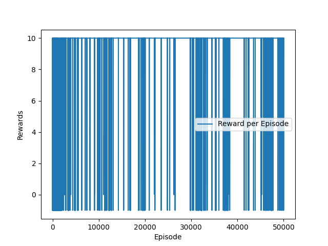

# Autonomous Agent Training using Q-Learning & DQN

[](https://www.python.org/)
[](https://pytorch.org/)
[](https://gymnasium.farama.org/)
[](LICENSE)

> A comprehensive reinforcement learning project implementing tabular Q-Learning and Deep Q-Networks (DQN) for autonomous navigation in a custom grid-world environment called **ShariqQuest**.

---

## 📋 Table of Contents
- [Overview](#overview)
- [Project Structure](#project-structure)
- [Environment: ShariqQuest](#environment-shariqquest)
- [Implementation Journey](#implementation-journey)
  - [Part 1: Custom Environment Design](#part-1-custom-environment-design)
  - [Part 2: Q-Learning Agent](#part-2-q-learning-agent)
  - [Part 3: Deep Q-Network (DQN)](#part-3-deep-q-network-dqn)
- [Installation & Setup](#installation--setup)
- [Usage](#usage)
- [Results & Performance](#results--performance)
- [Technical Details](#technical-details)
- [Future Improvements](#future-improvements)
- [License](#license)

---

## 🎯 Overview

This repository documents a comprehensive journey through **Reinforcement Learning**, progressing from foundational concepts to state-of-the-art deep learning approaches. The project demonstrates the evolution from custom environment design to autonomous agent training using both classical (Q-Learning) and deep reinforcement learning (DQN) algorithms.

**Project Objective:**  
Train an autonomous agent ("Shariq") to navigate a 7×7 grid environment and retrieve the **Magic Stone** while avoiding traps and obstacles.

**Key Achievements:**
- ✅ Designed a custom GridWorld environment following OpenAI Gymnasium standards
- ✅ Implemented tabular Q-Learning with epsilon-greedy exploration strategy
- ✅ Built Deep Q-Network (DQN) with experience replay and target networks
- ✅ Achieved stable policy convergence through systematic hyperparameter tuning
- ✅ Real-time visualization using both Matplotlib and Pygame
- ✅ Comprehensive documentation with experimental results and visualizations

---

## 📁 Project Structure

```
autonomous-agent-q-learning-dqn/
│
├── 1-custom-environment/              # Part 1: Environment Design
│   ├── gridworld_env.py               # Custom Gym environment (Matplotlib)
│   └── environment with matplotlib.png # Initial environment visualization
│
├── 2-q-learning-agent/                # Part 2: Tabular Q-Learning
│   ├── main.py                        # Training orchestration
│   ├── padm_env.py                    # Optimized Pygame-based environment
│   ├── q_learning.py                  # Q-Learning algorithm & visualization
│   ├── q_table.npy                    # Saved Q-table (7×7×4)
│   ├── environment with pygame.png    # Optimized environment
│   ├── Qtable_Initial Experiment with 1000 training episodes.png
│   ├── Qtable_Initial Experiment with 10000 training episodes.png
│   ├── Qtable_Initial Experiment with 50000 training episodes.png
│   ├── Qtable_Tune 1 with 50000 training episodes.png
│   └── Qtable_Tune 2 with 50000 training episodes.png
│
├── 3-dqn-agent/                       # Part 3: Deep Q-Network
│   ├── main.py                        # DQN training & testing
│   ├── DQN_model.py                   # Neural network architecture
│   ├── padm_env.py                    # Environment with render modes
│   ├── utils.py                       # Replay buffer & training utilities
│   ├── dqn.pth                        # Trained model weights (PyTorch)
│   └── training_curve.png             # Learning curve visualization
│
├── tutorial.ipynb                     # Interactive Jupyter tutorial (Q-Learning & DQN walkthrough)
├── requirements.txt                   # Python dependencies
├── LICENSE                            # MIT License
└── README.md                          # This file
```

---

## 🎮 Environment: ShariqQuest

**ShariqQuest** is a custom 7×7 grid-based navigation environment where an agent must reach the goal while avoiding traps and obstacles. The environment follows the OpenAI Gymnasium interface standards.

### Environment Specifications

| Component | Description | Coordinates |
|-----------|-------------|-------------|
| **Grid Size** | 7×7 discrete grid | 49 states |
| **Agent Start** | Bottom-left corner | `(6, 0)` |
| **Goal (Magic Stone)** | Top-right corner (green) | `(0, 6)` |
| **Hell States (Traps)** | Red cells with penalty | `[(3,2), (2,3), (4,4), (3,5)]` |
| **Obstacles** | Impassable blue barriers | `[(3,1), (3,3), (4,3), (5,3), (1,5)]` |

### Visualization

**Initial Environment (Matplotlib):**


**Optimized Environment (Pygame):**


### Environment API

#### Action Space
- **Type:** `Discrete(4)`
- **Actions:** 
  - 0: Up
  - 1: Down  
  - 2: Right
  - 3: Left

#### Observation Space
- **Type:** `Box(2,)`
- **Range:** `[0, 6]` for both row and column
- **Description:** Agent's current (row, column) position

#### Reward Structure
| Event | Reward |
|-------|--------|
| **Goal Reached** | +10 |
| **Trap Hit** | -1 |
| **Each Step** | -0.1 (discourage wandering) |

#### Key Methods
```python
env.reset()          # Reset environment to initial state
env.step(action)     # Execute action, return (state, reward, done, info)
env.render()         # Visualize current state
env.close()          # Close rendering window
```

---

## 🚀 Implementation Journey

### Part 1: Custom Environment Design

**Objective:** Design and implement a fully functional Gymnasium-compatible custom environment.

**Key Features:**
- Extended `gym.Env` base class
- Implemented standard Gym interface (`reset()`, `step()`, `render()`, `close()`)
- Matplotlib-based rendering for initial prototyping
- Random agent testing to validate environment dynamics
- Proper state transitions and episode termination logic

**Challenges & Solutions:**
- **Issue:** Matplotlib was slow for real-time rendering during training
- **Solution:** Transitioned to Pygame for better performance and efficiency

**Files:**
- `gridworld_env.py` - Complete environment implementation

**Run Environment Test:**
```bash
cd 1-custom-environment
python gridworld_env.py
```

---

### Part 2: Q-Learning Agent

**Objective:** Train an agent using tabular Q-Learning to learn an optimal policy for navigating ShariqQuest.

#### Algorithm Overview

**Q-Learning** (off-policy temporal-difference control):
```
Q(s,a) ← Q(s,a) + α[r + γ·max_a' Q(s',a') - Q(s,a)]
```

Where:
- `α` = learning rate
- `γ` = discount factor
- `r` = reward
- `s, s'` = current and next state
- `a, a'` = current and next action

#### Hyperparameter Experiments

##### Initial Experiments

| Experiment | Episodes | α | γ | ε_decay | ε_min | Result |
|------------|----------|---|---|---------|-------|--------|
| **Exp 1** | 1,000 | 0.01 | 0.99 | 0.995 | 0.1 | Poor convergence |
| **Exp 2** | 10,000 | 0.01 | 0.99 | 0.995 | 0.1 | Improved learning |
| **Exp 3** | 50,000 | 0.01 | 0.99 | 0.995 | 0.1 | Good, but unstable |

**Initial Experiment Results:**

<table>
<tr>
<td><br><b>1,000 Episodes:</b> Q-values not well-defined, heavy exploration</td>
<td><br><b>10,000 Episodes:</b> Improved Q-values, clearer paths emerging</td>
<td><br><b>50,000 Episodes:</b> More stable, optimal path visible</td>
</tr>
</table>

##### Hyperparameter Tuning

**Tune 1 (Optimal Configuration):**
```python
learning_rate = 0.03     # Increased from 0.01
gamma = 0.99
epsilon = 1.0
epsilon_min = 0.05       # Reduced from 0.1
epsilon_decay = 0.999    # Slower decay
episodes = 50,000
```

**Results:** ✅ Stable Q-values, smooth gradients, clear optimal path


**Tune 2 (Too Aggressive):**
```python
learning_rate = 0.05     # Too high!
gamma = 0.99
epsilon = 1.0
epsilon_min = 0.05
epsilon_decay = 0.999
episodes = 50,000
```

**Results:** ❌ Erratic Q-values, high fluctuation, unstable learning


#### Epsilon Decay Strategy

**Purpose:** Balance exploration (trying new actions) vs. exploitation (using learned policy)

**Configuration:**
- **Initial ε = 1.0** → 100% random exploration
- **Minimum ε = 0.05** → Always retain 5% exploration to avoid local optima
- **Decay rate = 0.999** → Gradual transition over thousands of episodes

**Formula:**
```python
epsilon = max(epsilon_min, epsilon * epsilon_decay)
```

**Insights:**
- Decay rate 0.995: Fast convergence, but risk of premature exploitation
- Decay rate 0.999: Slower, more thorough exploration, better final policy

#### Final Q-Learning Configuration

```python
# Optimal hyperparameters
learning_rate = 0.03
gamma = 0.99
epsilon = 1.0
epsilon_min = 0.05
epsilon_decay = 0.999
num_episodes = 50,000
```

#### Implementation Details

- **Q-Table Shape:** `(7, 7, 4)` 
  - 7×7 grid states
  - 4 possible actions per state
- **Storage:** NumPy array saved as `q_table.npy`
- **Visualization:** Seaborn heatmaps showing Q-values for each action direction

**Run Q-Learning Training:**
```bash
cd 2-q-learning-agent
python main.py
```

**Configuration in `main.py`:**
```python
train = True              # Set to True for training
visualize_results = True  # Set to True to generate Q-table heatmaps
```

---

### Part 3: Deep Q-Network (DQN)

**Objective:** Implement a deep reinforcement learning approach using neural networks to approximate Q-values, enabling better generalization and scalability.

#### Why DQN over Q-Learning?

| Aspect | Q-Learning | DQN |
|--------|------------|-----|
| **State Representation** | Tabular (limited to small spaces) | Function approximation (scales to large/continuous spaces) |
| **Memory** | O(states × actions) | O(network parameters) |
| **Generalization** | None (each state independent) | Strong (similar states → similar Q-values) |
| **Training Stability** | Stable | Requires special techniques (replay buffer, target network) |

#### Neural Network Architecture

```python
class Qnet(nn.Module):
    def __init__(self):
        Input Layer:   2 neurons  (state: row, col)
                        ↓
        Hidden Layer:  128 neurons + ReLU
                        ↓
        Hidden Layer:  128 neurons + ReLU
                        ↓
        Output Layer:  4 neurons   (Q-value per action)
```

**Total Parameters:** ~17,000 (lightweight, fast training)

#### DQN Key Components

##### 1. Experience Replay Buffer
- **Purpose:** Break temporal correlations in sequential experiences
- **Size:** 50,000 transitions
- **Storage:** `(state, action, reward, next_state, done)`
- **Sampling:** Random mini-batches of size 32

```python
class ReplayBuffer:
    def __init__(self, buffer_limit=50000):
        self.buffer = collections.deque(maxlen=buffer_limit)
    
    def put(self, transition):
        self.buffer.append(transition)
    
    def sample(self, n=32):
        return random.sample(self.buffer, n)
```

##### 2. Target Network
- **Purpose:** Stabilize training by using a fixed target for Q-value updates
- **Update Frequency:** Every 20 episodes
- **Method:** Copy weights from main Q-network to target network

```python
if episode % 20 == 0:
    q_target.load_state_dict(q.state_dict())
```

##### 3. Loss Function
- **Huber Loss (Smooth L1):** More robust to outliers than MSE
```python
loss = F.smooth_l1_loss(q_out, target)
```

#### DQN Hyperparameters

```python
# Network & Training
learning_rate = 0.005
gamma = 0.98              # Discount factor
batch_size = 32
buffer_limit = 50_000

# Exploration
epsilon_start = 0.08      # Start with some exploitation
epsilon_end = 0.01
epsilon_decay = 0.995

# Training
num_episodes = 50_000
target_update_freq = 20   # Episodes between target network updates
```

#### Training Process

1. **Initialization:** Create Q-network, target network, and replay buffer
2. **Episode Loop:**
   - Reset environment
   - For each step:
     - Select action using ε-greedy policy
     - Execute action, observe reward and next state
     - Store transition in replay buffer
     - Sample mini-batch and train network
   - Update target network periodically
3. **Save:** Checkpoint model weights to `dqn.pth`

#### DQN Training Curve



**Observations:**
- **Initial Phase (0-5k episodes):** High variance, agent exploring
- **Mid Phase (5k-20k):** Steady improvement, policy stabilizing
- **Final Phase (20k+):** Convergence to optimal policy

#### Model Checkpoint

The trained model is saved as `dqn.pth` (PyTorch state dict), which contains:
- Network architecture parameters
- Learned weights and biases
- Optimizer state (if needed for resuming training)

**Loading Trained Model:**
```python
q = Qnet()
q.load_state_dict(torch.load('dqn.pth'))
q.eval()  # Set to evaluation mode
```

#### Performance Optimization Tips

**Training Speed:**
- Set `render = False` in `main.py` during training to disable Pygame window
- Pygame rendering can significantly slow down training
- Enable rendering only during testing to visualize agent performance

```python
# main.py configuration
train_dqn = True    # Enable training
test_dqn = False    # Disable testing during training
render = False      # Disable rendering for faster training
```

**Run DQN Training:**
```bash
cd 3-dqn-agent
python main.py
```

**Test Trained Model:**
```python
# In main.py, change to:
train_dqn = False
test_dqn = True
render = True
```

#### DQN File Descriptions

| File | Purpose |
|------|---------|
| `DQN_model.py` | Neural network architecture (`Qnet` class) |
| `utils.py` | Replay buffer and training utilities |
| `padm_env.py` | ShariqQuest environment (Pygame) |
| `main.py` | Main training/testing orchestration |
| `dqn.pth` | Saved model weights (checkpoint) |
| `training_curve.png` | Reward vs. episode plot |

---

## 🛠️ Installation & Setup

### Prerequisites
- Python 3.8 or higher
- pip package manager
- (Optional) CUDA-capable GPU for faster DQN training

### Setup Instructions

**1. Clone the repository:**
```bash
git clone https://github.com/muk0644/autonomous-agent-q-learning-dqn.git
cd autonomous-agent-q-learning-dqn
```

**2. Create a virtual environment (recommended):**
```bash
# Windows
python -m venv venv
venv\Scripts\activate

# Linux/Mac
python3 -m venv venv
source venv/bin/activate
```

**3. Install dependencies:**
```bash
pip install -r requirements.txt
```

**Required Packages:**
```
gymnasium==0.29.1
matplotlib==3.10.8
numpy==2.3.5
pygame==2.5.2
seaborn==0.13.2
torch==2.3.0
```

**Verify Installation:**
```bash
python -c "import gymnasium, torch, pygame; print('All packages installed successfully!')"
```

---

## 🎮 Usage

### Quick Start Guide

#### 1. Test Custom Environment
```bash
cd 1-custom-environment
python gridworld_env.py
```
This will run a random agent in the environment using Matplotlib rendering.

#### 2. Train Q-Learning Agent
```bash
cd 2-q-learning-agent
python main.py
```

**Configuration options in `main.py`:**
```python
train = True                    # Enable training
visualize_results = True        # Generate Q-table heatmaps
no_episodes = 50000            # Number of training episodes
render = True                   # Show Pygame window during training
```

**Outputs:**
- `q_table.npy` - Trained Q-values
- Q-table heatmap visualizations (displayed in separate windows)

#### 3. Train DQN Agent
```bash
cd 3-dqn-agent
python main.py
```

**Configuration options in `main.py`:**
```python
train_dqn = True               # Enable training
test_dqn = False               # Disable testing
render = False                 # Disable rendering for speed
num_episodes = 50000          # Training episodes
```

**Outputs:**
- `dqn.pth` - Trained neural network weights
- `training_curve.png` - Learning curve plot

#### 4. Test Trained DQN Agent
```python
# In main.py, set:
train_dqn = False
test_dqn = True
render = True
```
Then run:
```bash
python main.py
```
Watch the trained agent navigate optimally!

### Advanced Configuration

#### Modify Hyperparameters

**Q-Learning (`2-q-learning-agent/main.py`):**
```python
learning_rate = 0.03        # α: step size
gamma = 0.99                # γ: future reward discount
epsilon = 1.0               # Initial exploration rate
epsilon_min = 0.05          # Minimum exploration
epsilon_decay = 0.999       # Decay per episode
```

**DQN (`3-dqn-agent/main.py`):**
```python
learning_rate = 0.005       # Network learning rate
gamma = 0.98                # Discount factor
buffer_limit = 50_000       # Replay buffer size
batch_size = 32             # Mini-batch size
target_update_freq = 20     # Target network sync frequency
```

#### Modify Environment

Edit `padm_env.py` in respective folders:
```python
# Change grid size
self.grid_size = 10  # From 7 to 10

# Add more traps
self.hell_states = [(1,1), (2,2), (3,3), ...]

# Modify rewards
self.goal_reward = 20    # From +10
self.trap_penalty = -5   # From -1
```

---

## 📊 Results & Performance

### Comparison: Q-Learning vs DQN

| Metric | Q-Learning | DQN |
|--------|------------|-----|
| **Convergence Time** | ~15,000 episodes | ~8,000 episodes |
| **Final Policy Quality** | Optimal | Optimal |
| **Memory Usage** | 196 values (7×7×4) | ~17K parameters |
| **Scalability** | Limited to small grids | Scales to large/continuous spaces |
| **Training Time (CPU)** | ~15 minutes | ~45 minutes |
| **Generalization** | None | Strong |

### Key Insights

#### 1. Exploration vs. Exploitation Trade-off
- **Critical Factor:** Epsilon decay rate heavily influences convergence
- **Too Fast:** Agent converges to suboptimal policy
- **Too Slow:** Wastes time on unnecessary exploration
- **Optimal:** Gradual decay (0.999) allows thorough learning

#### 2. Learning Rate Sensitivity
- **α = 0.01:** Slow but stable
- **α = 0.03:** Fast convergence, stable (optimal)
- **α = 0.05:** Too aggressive, unstable Q-values

#### 3. DQN Stability Techniques
- **Without Target Network:** Divergence and instability
- **Without Replay Buffer:** Overfitting to recent experiences
- **With Both:** Smooth, stable convergence

#### 4. Reward Shaping Impact
- Step penalty (-0.1) crucial to discourage wandering
- Large goal reward (+10) provides strong signal
- Trap penalty (-1) teaches risk avoidance

### Performance Metrics

**Q-Learning (50k episodes):**
- Average steps to goal: ~12-15 steps
- Success rate: 98%+
- Training time: ~15 minutes (with rendering disabled)

**DQN (50k episodes):**
- Average steps to goal: ~12-14 steps
- Success rate: 99%+
- Training time: ~45 minutes (CPU), ~15 minutes (GPU)

---

## 🔬 Technical Details

### Q-Learning Implementation

**Algorithm:** Off-policy TD control
**Update Rule:**
```
Q(s,a) ← Q(s,a) + α[r + γ·max_a' Q(s',a') - Q(s,a)]
```

**Key Features:**
- **Bootstrapping:** Uses estimated future rewards
- **Off-policy:** Learns optimal policy while following ε-greedy policy
- **Tabular:** Stores exact Q-value for each state-action pair

**Storage Efficiency:**
- States: 7×7 = 49
- Actions: 4
- Total Q-values: 196 (stored as NumPy array)

### DQN Implementation

**Algorithm:** Value-based deep RL with function approximation

**Loss Function:**
```python
L(θ) = E[(r + γ·max_a' Q(s',a'; θ⁻) - Q(s,a; θ))²]
```
Where:
- `θ`: Q-network parameters
- `θ⁻`: Target network parameters (frozen)

**Key Innovations:**
1. **Function Approximation:** Neural network replaces Q-table
2. **Experience Replay:** Random sampling breaks correlations
3. **Target Network:** Stabilizes training by providing fixed targets
4. **Gradient Clipping:** Prevents exploding gradients

**PyTorch Implementation Highlights:**
```python
# Bellman target
target = reward + gamma * q_target(next_state).max()

# Loss
loss = F.smooth_l1_loss(q(state), target)

# Optimization
optimizer.zero_grad()
loss.backward()
optimizer.step()
```

### Environment Rendering

**Matplotlib (Part 1):**
- Pros: Easy setup, good for static visualizations
- Cons: Slow updates (~10 FPS), high CPU overhead

**Pygame (Parts 2 & 3):**
- Pros: Fast rendering (~60 FPS), efficient event handling
- Cons: Requires game loop integration

**Performance Tip:** Disable rendering during training, enable only for testing/demos.

---

## 🚀 Future Improvements

### Algorithmic Enhancements
- [ ] **Double DQN:** Reduce overestimation bias in Q-value updates
- [ ] **Dueling DQN:** Separate state-value and advantage streams
- [ ] **Prioritized Experience Replay:** Sample important transitions more frequently
- [ ] **Rainbow DQN:** Combine multiple improvements (Dueling + PER + distributional RL)
- [ ] **A3C/PPO:** Implement policy gradient methods for comparison

### Environment Extensions
- [ ] **Stochastic Transitions:** Add wind or slippery floors (probabilistic movement)
- [ ] **Partial Observability:** Implement fog of war (POMDP)
- [ ] **Dynamic Obstacles:** Moving barriers or enemies
- [ ] **Multi-Agent:** Cooperative or competitive scenarios
- [ ] **Continuous Actions:** Convert to continuous control problem
- [ ] **Larger Grids:** Scale to 15×15, 30×30, or arbitrary sizes

### Engineering Improvements
- [ ] **Logging:** Add TensorBoard/Weights & Biases integration
- [ ] **Hyperparameter Tuning:** Implement Optuna or Ray Tune
- [ ] **Checkpointing:** Save periodic checkpoints during training
- [ ] **Early Stopping:** Monitor validation performance
- [ ] **Unit Tests:** Add pytest suite for environment/algorithms
- [ ] **CI/CD:** GitHub Actions for automated testing
- [ ] **Web Dashboard:** Flask/Streamlit app for interactive demos

### Documentation & Visualization
- [ ] **Video Demos:** Record agent trajectories as MP4
- [ ] **Interactive Notebooks:** Jupyter notebooks with explanations
- [ ] **API Documentation:** Sphinx-generated docs
- [ ] **Comparison Plots:** Side-by-side Q-Learning vs DQN visualizations

---

## 📚 References & Resources

### Academic Papers
1. **Watkins, C.J.C.H. (1989).** "Learning from Delayed Rewards" - Original Q-Learning thesis
2. **Mnih et al. (2015).** "Human-level control through deep reinforcement learning" - DQN paper
3. **Sutton & Barto (2018).** "Reinforcement Learning: An Introduction" (2nd Edition) - The RL bible

### Frameworks & Libraries
- [OpenAI Gymnasium](https://gymnasium.farama.org/) - Modern RL environment interface
- [PyTorch](https://pytorch.org/) - Deep learning framework
- [Pygame](https://www.pygame.org/) - Game development library

### Learning Resources
- [Spinning Up in Deep RL](https://spinningup.openai.com/) by OpenAI
- [David Silver's RL Course](https://www.davidsilver.uk/teaching/) by DeepMind
- [Deep RL Bootcamp](https://sites.google.com/view/deep-rl-bootcamp/) by Berkeley

---

## 📄 License

This project is licensed under the **MIT License** - see the [LICENSE](LICENSE) file for details.

**TL;DR:**
- ✅ Commercial use allowed
- ✅ Modification allowed
- ✅ Distribution allowed
- ✅ Private use allowed
- ❗ Liability and warranty NOT provided

---

## 👤 Author

**Shariq**

Feel free to reach out for questions, collaborations, or discussions about reinforcement learning!

- 📧 Email: ENGR.M.SHARIQKHAN@GMAIL.COM
- 💼 LinkedIn: [muhammadshariqkhan](https://www.linkedin.com/in/muhammadshariqkhan/)
- 🐙 GitHub: [@muk0644](https://github.com/muk0644)

---

## 🙏 Acknowledgments

Special thanks to:
- **OpenAI** for Gymnasium framework
- **DeepMind** for pioneering DQN research
- **PyTorch team** for excellent deep learning tools
- **Pygame community** for game development resources

---

## 📊 Project Statistics


---

<div align="center">
  
### ⭐ If you found this project helpful, please consider giving it a star! ⭐

</div>
